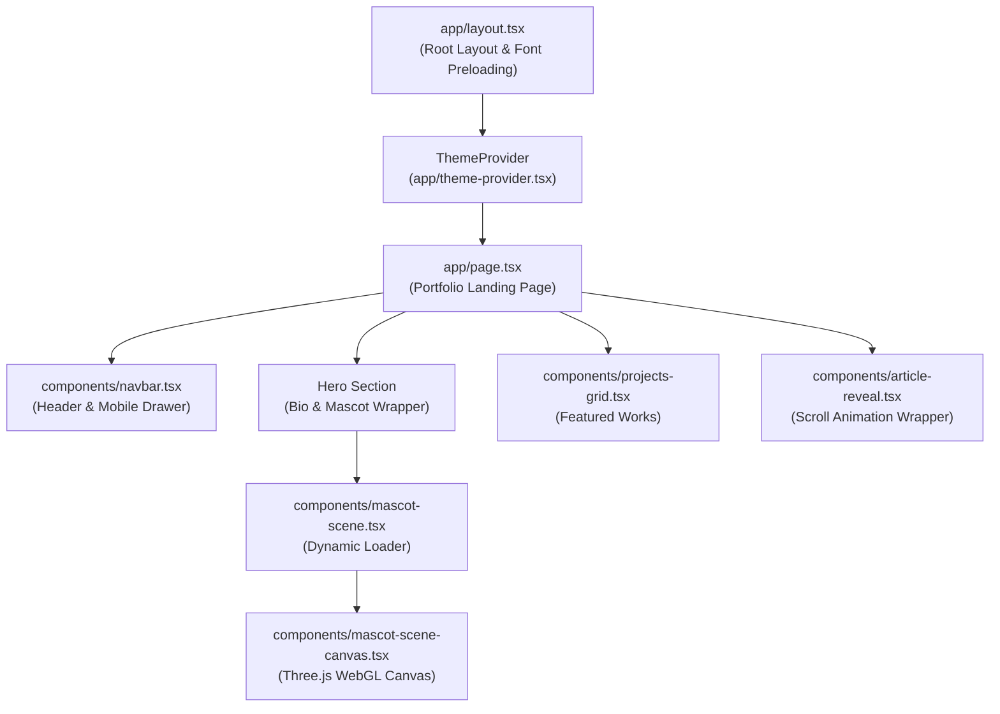

# Miguel Barra — Developer Portfolio

[](https://nextjs.org/)
[](https://react.dev/)
[](https://www.typescriptlang.org/)
[](https://threejs.org/)
[](https://tailwindcss.com/)
[](https://vitest.dev/)
[](https://playwright.dev/)

An engineering-led, modern interactive developer portfolio for **Miguel Barra**, built using Next.js 16 (App Router), React 19, Three.js 3D WebGL animations, and Tailwind CSS v4.

Designed with high-end aesthetics, smooth scroll reveals, dark/light theme switching with persistence, zero-flash layout hydration, and strict WCAG AA accessibility compliance.

---

## 🚀 Quickstart

### Prerequisites

- **Node.js**: `^20.0.0` or `>= 18.18.0`
- **npm**: `>= 9.0.0`

### Installation & Local Development

```bash
# 1. Clone the repository
git clone https://github.com/mbarradev/portfolio.git
cd portfolio

# 2. Install dependencies
npm install

# 3. Launch local dev server
npm run dev
```

Open [http://localhost:3000](http://localhost:3000) in your browser to explore the portfolio.

---

## ✨ Key Features

- **Interactive 3D WebGL Mascot**: Built with Three.js (`mascot-scene-canvas.tsx`), dynamically lazy-loaded on the client side with `next/dynamic(..., { ssr: false })` to optimize initial page load performance.
- **Next.js 16 App Router Architecture**: Server-first layout with isolated Client Component boundaries for micro-interactions and state.
- **Zero-Flash Theme Engine**: Custom `ThemeProvider` supporting system preferences, dark mode, light mode, and `localStorage` state persistence without visual flash during SSR hydration.
- **Smooth Scroll & Micro-Animations**: Intersect Observer custom hook (`useScrollReveal`) for dynamic element reveals as the user scrolls down the page.
- **Component Dev Bench**: Dedicated `/dev-*` preview routes (`/dev-button`, `/dev-mascot-scene`, `/dev-colors`, `/dev-projects-grid`, etc.) for visual testing in isolation.
- **High-Performance & Accessible**: Audited with Lighthouse 13.4 (Performance 89+, Accessibility 96, Best Practices 100, SEO 100).

---

## 🛠 Tech Stack & Architecture

| Layer            | Technology                       | Purpose                                                |
| :--------------- | :------------------------------- | :----------------------------------------------------- |
| **Framework**    | Next.js 16.2 (App Router)        | Server-side rendering, routing, font optimization      |
| **UI Library**   | React 19.2                       | Client component state & DOM rendering                 |
| **Language**     | TypeScript 5                     | End-to-end type safety                                 |
| **3D Engine**    | Three.js 0.185                   | WebGL interactive 3D mascot rendering                  |
| **Styling**      | Tailwind CSS v4 & PostCSS        | Utility-first responsive design system & CSS variables |
| **Unit Testing** | Vitest 4 & React Testing Library | Component integration & unit tests                     |
| **E2E Testing**  | Playwright 1.62                  | End-to-end browser integration testing                 |
| **Quality**      | ESLint 9 & Prettier 3            | Static code analysis & code formatting                 |

### System Overview



---

## 🧪 Testing & Code Quality

Execute the full verification suite before submitting PRs:

```bash
# Run unit and component integration tests (Vitest)
npm run test

# Run end-to-end browser tests (Playwright)
npm run test:e2e

# Run ESLint check
npm run lint

# Verify Prettier formatting
npm run format:check

# Run production build compilation
npm run build
```

---

## 📑 Documentation Index

Detailed technical guides and documentation surfaces:

- 🏗 **[Architecture Overview](./docs/ARCHITECTURE.md)**: Deep dive into state management, WebGL canvas lazy loading, theme persistence, and CSS design tokens.
- 💻 **[Developer Guide](./docs/DEVELOPMENT.md)**: Component creation workflow, dev preview routes, and test bench usage.
- ⚡️ **[Lighthouse Audit Report](./docs/lighthouse-audit.md)**: Performance benchmarks, LCP font optimization details, and WCAG AA accessibility audit.
- 🤝 **[Contributing Guidelines](./CONTRIBUTING.md)**: Pull Request flow, local setup, and branch strategies.
- 🤖 **[Agent Instructions](./AGENTS.md)**: Canonical rules, boundaries, and commands for AI coding assistants.

---

## 📄 License & Credits

Designed and developed by **Miguel Barra**. All rights reserved.
